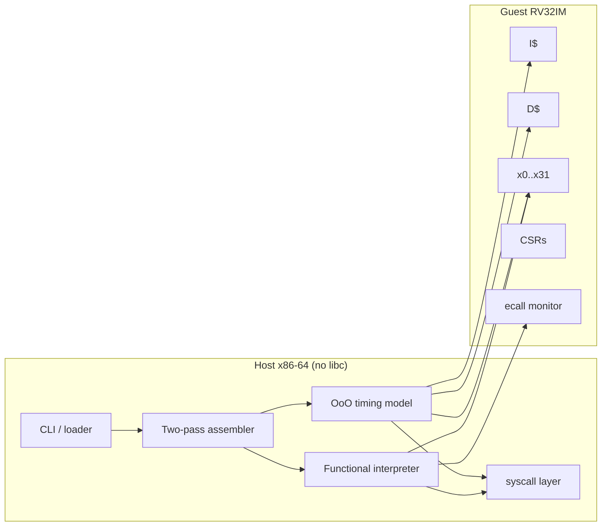

# Planck

**A cycle-accurate out-of-order RV32IM core, cache hierarchy, and assembler — written in pure x86-64 assembly.**

Zero libc. Zero C. Linux syscalls, NASM, and a microarchitecture you can actually measure.

```
                 Planck microarchitecture  (2-wide Tomasulo + ROB)
  ┌─────────┐   ┌──────────┐   ┌───────────┐   ┌──────────┐   ┌──────────┐
  │  I$ L1  │──▶│  Decode  │──▶│  Rename   │──▶│ Issue RS │──▶│    FU    │
  │ 16 KiB  │   │  2-wide  │   │ 96 phys   │   │ ALU/BR/M │   │ + LSU    │
  └─────────┘   └──────────┘   └─────┬─────┘   └──────────┘   └────┬─────┘
       ▲                             │                              │
       │                        ┌────▼─────┐                        │
       │                        │ ROB  64  │◀────── writeback ──────┘
       │                        │ commit×2 │
       │                        └────┬─────┘
       │                             │
  ┌────┴─────┐   ┌──────────┐   ┌────▼─────┐   ┌──────────┐
  │   BTB    │   │ gshare + │   │   L1D    │──▶│  L2 8-way│──▶ mem 100c
  │ RAS  16  │   │tournament│   │ 16 KiB   │   │  256 KiB │
  └──────────┘   └──────────┘   └──────────┘   └──────────┘
```

Planck is a host program that **is** a CPU: an x86-64 binary with no C runtime that boots an RV32IM guest, assembles it, runs it through either a functional interpreter or a cycle-accurate superscalar core, and prints IPC, cache miss rates, branch mispredicts, and ROB stall breakdowns.

It exists because the interesting part of a processor is not the ISA cheat-sheet — it is rename, replay, store forwarding, and the days you lose to a cache-line-sized bug.

## Why this exists

Most “I wrote a CPU” projects are Verilog on an FPGA, or a C interpreter with a pipeline cartoon. Planck is the other axis:

- The **simulator is assembly**, so the host has no hidden allocator, no libc buffering, no surprise syscalls on the hot path.
- The **guest is RISC-V**, so every instruction, CSR, and trap has a spec you can disagree with in public.
- The **timing model is a real OoO core**, not “add 1 to a cycle counter per instruction.”

If you hire for compilers, CPU, kernel, HFT FPGA, or performance engineering, this is the artifact I want on the table: data layouts, invariants, and cycle counters — not a framework.

## What it does

| Surface | What you get |
|---|---|
| **ISA** | RV32IM + privileged subset (`mstatus`, `mtvec`, `mepc`, `mcause`, `mcycle`, `minstret`, …) |
| **Assembler** | Two-pass RV32 assembler with pseudos (`li`, `call`, `ret`, `beqz`, …), locals, `.word`/`.ascii` |
| **Disassembler** | Round-trip capable dump of guest memory |
| **Functional core** | Spec-faithful interpreter used as the golden model |
| **OoO core** | 2-wide fetch/decode/issue/commit, 64-entry ROB, 96 physical regs, distributed RS, load-store unit with forwarding |
| **Memory system** | Virtually-indexed L1I/L1D, inclusive L2, 32-entry TLB, parameterized miss penalties |
| **Prediction** | Bimodal + gshare + tournament, BTB, return-address stack |
| **Monitor** | `ecall` ABI for exit/write/sbrk/cycles so guest programs can talk to the host |
| **Verification** | Self-hosted test binary: ALU, mem, branches, M-ext, assembler, cache, predictor, program suite |
| **Telemetry** | Per-structure hit/miss/kill counters and an HDR-style latency histogram of host `rdtsc` around the run loop |

## Quick start

The binary is Linux **x86-64**. On Apple Silicon or any non-amd64 host, Docker is the supported path.

```bash
# build
docker build --platform linux/amd64 -t planck .

# functional run of an in-tree program
docker run --rm --platform linux/amd64 planck run /opt/planck/programs/fib.s

# cycle-accurate out-of-order run with a stats dump
docker run --rm --platform linux/amd64 planck run --mode ooo --stats /opt/planck/programs/qsort.s

# in-tree verification
docker run --rm --platform linux/amd64 planck test

# host-side microbench of the interpreter and the OoO model
docker run --rm --platform linux/amd64 planck bench
```

Without Docker, on an amd64 Linux box with `nasm` and GNU `ld`:

```bash
make
./bin/planck test
./bin/planck run programs/fib.s
./bin/planck run --mode ooo --stats programs/matmul.s
```

## CLI

```
planck <command> [flags] [file]

commands
  run       assemble (if .s) and execute a guest
  asm       assemble to a raw RV32 image and write it
  disasm    disassemble a guest image
  test      run the assembly test suite
  bench     interpreter vs OoO host-cycle comparison
  version   print build identity

run flags
  --mode functional|ooo     default functional
  --mem <bytes>             guest RAM, default 64 MiB
  --trace                   print retired PC + disassembly
  --stats                   print microarchitectural counters
  --max-inst <n>            retire cap (safety)
  --max-cycle <n>           cycle cap in ooo mode
  --entry <addr>            override entry (default 0x80000000)
  --dump-regs               architectural register file at halt
```

## Architecture at one glance

Guest physical memory is a single `mmap` region. Guest addresses are `0x80000000`-based (SiFive / Spike convention). The host never allocates on the run loop: the CPU struct, ROB, reservation stations, caches, and predictor tables are carved out of one arena at boot.



Deeper diagrams and invariants live in [`docs/ARCHITECTURE.md`](docs/ARCHITECTURE.md). The ISA contract is [`docs/ISA.md`](docs/ISA.md). The OoO pipeline is [`docs/MICROARCHITECTURE.md`](docs/MICROARCHITECTURE.md). The memory system is [`docs/MEMORY.md`](docs/MEMORY.md). The assembler grammar is [`docs/ASSEMBLER.md`](docs/ASSEMBLER.md).

## Module map

```
src/
  include/     ABI, structure offsets, ISA constants, macros
  host/        _start, syscalls, mmap arena, formatting, hashmap
  core/        decode, execute, CSRs, traps, functional run loop
  asm/         lexer, parse, encode, pseudos, relocs, symbols
  disasm/      printer
  cache/       L1I, L1D, L2, TLB
  predict/     bimodal, gshare, tournament, BTB, RAS
  ooo/         rename, ROB, RS, FUs, LSU, pipeline tick
  stats/       counters, host rdtsc histogram, report
  monitor/     ecall ABI, image loader
programs/      guest RISC-V: fib, qsort, memcpy, matmul, crc32, dhrystone-ish
tests/         assembly unit + integration tests
```

Every file is NASM. The test binary is assembly. The guest programs are RISC-V assembly assembled by Planck itself.

## Performance model (what `--stats` means)

The OoO core is **not** a Verilog RTL dump. It is an event-driven model of a 2-wide machine with explicit latencies:

| Resource | Default |
|---|---|
| Fetch / decode / issue / commit width | 2 |
| ROB | 64 |
| Physical registers | 96 |
| ALU RS / latency | 8 / 1c |
| Branch RS / latency | 4 / 1c |
| Mul RS / latency | 2 / 3c |
| Div RS / latency | 1 / 16c |
| Load / store RS | 8 / 8 |
| L1I | 16 KiB, 2-way, 64 B, 1c |
| L1D | 16 KiB, 4-way, 64 B, 3c hit, WB/WA |
| L2 | 256 KiB, 8-way, 12c, inclusive |
| DRAM | 100c |
| Gshare history | 12 bits, 4 K counters |
| BTB | 128 entries |
| RAS | 16 |

IPC is `minstret / mcycle` as the core counted it, not as the host wall clock saw it. Host `rdtsc` is reported separately so you can see how expensive the *model* is, which is a different (and also interesting) number.

## Design constraints I actually kept

1. **No libc.** `write`, `read`, `openat`, `close`, `mmap`, `munmap`, `clock_gettime`, `exit`. That is the host ABI.
2. **No allocation after `cpu_init`.** If a structure is on the run path, it was carved from the arena.
3. **Integer guest.** RV32IM only. No IEEE-754 in the core. Fixed-width prices of a different kind.
4. **Functional core is the spec.** If OoO and functional disagree on a retired register or store, that is a simulator bug, and tests treat it as one.
5. **x0 is never renamed to a writable physical register.** The oldest trick in the book, still easy to get wrong.

## Documentation

| Document | Contents |
|---|---|
| [docs/ARCHITECTURE.md](docs/ARCHITECTURE.md) | Host/guest split, data layout, boot, run loops |
| [docs/ISA.md](docs/ISA.md) | RV32IM encodings, traps, CSRs, `ecall` ABI |
| [docs/MICROARCHITECTURE.md](docs/MICROARCHITECTURE.md) | Rename, ROB, RS, LSU, recovery |
| [docs/MEMORY.md](docs/MEMORY.md) | Caches, TLB, miss status, inclusion |
| [docs/PREDICTION.md](docs/PREDICTION.md) | Tournament predictor, BTB, RAS |
| [docs/ASSEMBLER.md](docs/ASSEMBLER.md) | Grammar, pseudos, relocation |
| [docs/HOST.md](docs/HOST.md) | Syscalls, arena, formatting, hashmap |
| [docs/VERIFICATION.md](docs/VERIFICATION.md) | Test philosophy, golden model |
| [docs/LAYOUT.md](docs/LAYOUT.md) | Byte offsets of every struct (the ABI between `.asm` files) |
| [docs/diagrams.md](docs/diagrams.md) | Extra mermaid: pipeline, cache fill, mispredict |

## Building from source (Linux amd64)

```
nasm 2.16+
GNU ld
make
```

```bash
make            # bin/planck
make test       # assemble tests, run ./bin/planck test
make lines      # count instruction and source lines
```

`make lines` is the honest accounting: NASM source under `src/` and `tests/`, not generated junk.

## What I would ask a reviewer to look at

If you only open three files, make them:

1. `src/ooo/pipeline.asm` — one cycle of the machine, in order, with the stall reasons.
2. `src/ooo/lsu.asm` — store buffer search, load replay, the thing everyone under-specifies.
3. `src/asm/encode.asm` — the ISA as a table, not a switch-statement novel.

Then `docs/MICROARCHITECTURE.md` for the invariants those files are supposed to keep.

## License

MIT. See [LICENSE](LICENSE).
