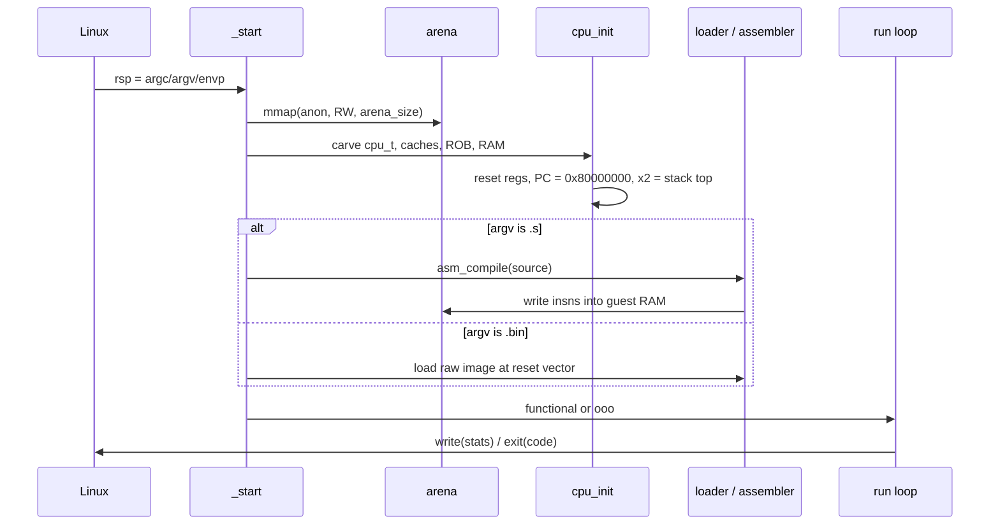
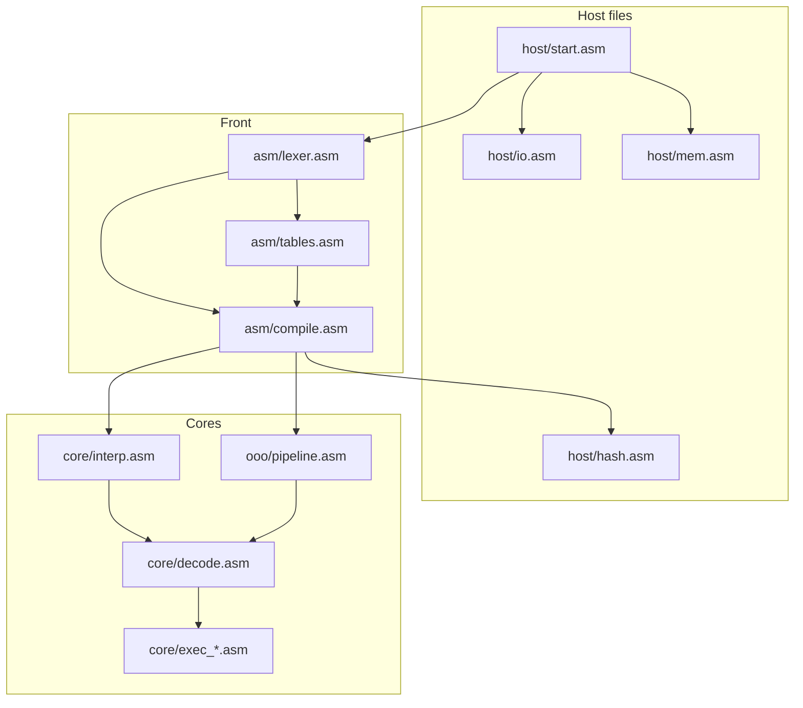

# Architecture

Planck is two machines sharing a process.

The **host** is an x86-64 Linux program with no C runtime. `_start` is the real entry. It mmaps one arena, parses argv by walking the stack, and never calls into glibc because glibc is not linked.

The **guest** is an RV32IM hart living in that arena: 32 architectural registers, a PC, a handful of machine-mode CSRs, and a physical memory image whose addresses start at `0x80000000`.

The host can execute the guest two ways:

- **Functional.** Decode one instruction, execute it, retire it, increment `minstret` and a trivial `mcycle`. This is the golden model.
- **Out-of-order.** Tick a 2-wide Tomasulo machine with a ROB until the same architectural state is reached, with `mcycle` counting modeled core cycles.

If those two machines disagree on a retired register, a store, or a trap, the simulator is wrong. Tests that matter compare them.

## Address spaces

```
guest VA/PA (identity, machine mode)
0x00000000  unused (null page, faults)
...
0x80000000  reset vector, .text
0x80010000  default .data
0x80100000  default heap base (sbrk)
0x80000000 + mem_size - 64KiB   stack growing down

host
[cpu_t][rob][rs][map][freelist][l1i][l1d][l2][tlb][pred][hist][guest RAM...]
 ^
 arena_base from mmap
```

Guest physical address `G` translates to host pointer

```
host = cpu.mem_base + (G - 0x80000000)
```

Any `G` outside `[0x80000000, 0x80000000 + mem_size)` is a load/store access fault. Instruction fetch from the same range is an instruction access fault. Address `0` is not mapped on purpose so null-pointer guest bugs die loudly.

Machine mode uses identity mapping. The TLB still exists: it is a 32-entry fully associative cache of that identity map, so the *miss penalty model* is real even when the page table is a fiction. That is deliberate. A TLB you never miss is a TLB you did not write.

## Boot sequence



`cpu_reset` zeros the architectural file, forces `x0 = 0`, sets `pc = 0x80000000`, `x2 (sp)` to the high end of RAM minus 16, `mstatus.MPP = M`, and clears pending traps. The first instruction executed is whatever the assembler (or image) placed at the reset vector.

## Two run loops

### Functional

```
loop:
  if halt: break
  if minstret >= max_inst: break
  inst = fetch32(pc)          ; may trap
  dec  = decode(inst, pc)     ; illegal -> trap
  execute(dec)                ; may trap, may write mem
  x0 = 0                      ; belt and suspenders
  minstret++
  mcycle++                    ; 1-cycle machine
```

Every architectural write goes through `wb_rd(rd, val)` so `rd == 0` is a single cmp, not a special case in fifty execute functions.

### Out-of-order

One call to `ooo_tick` is one *core* cycle. Inside, in this order:

1. **Commit** up to 2 ROB entries that are complete and not squashed. Stores commit by draining the head of the store buffer into L1D. Branches that were mispredicted have already squashed younger uops at writeback; commit just frees their ROB slots.
2. **Writeback** from FUs whose remaining latency hit zero. Broadcast `(preg, value)` to every RS entry and to the ROB. Loads that issued and now have data do the same. Mispredicted branches set `squash_pc` and a flag; the actual rewind happens at the end of the tick.
3. **Execute / issue to FUs.** Scan RS for ready ops whose FU is free. Payload goes into the FU pipe; RS entry stays allocated until writeback (classic reservation station).
4. **Rename / dispatch** up to 2 decoded uops into ROB + RS, allocating physical destinations, reading the front-end map table for sources.
5. **Decode** up to 2 instructions from the fetch queue.
6. **Fetch** up to 2 instructions: BTB + tournament prediction, L1I lookup, enqueue.

Squash, if flagged, restores the architectural map table from the ROB walk (young to old), resets the fetch queue, redirects PC, and increments a recovery counter.

The order is not aesthetic. Commit-first is how you keep ROB capacity moving. Fetch-last is how you avoid using a redirected PC in the same cycle you just discovered you were wrong, unless you explicitly model same-cycle redirect, Planck does not. Redirects take one bubble. That is documented, parameterized, and counted as `stall.redirect`.

## Data layout philosophy

Every cross-file structure has a frozen offset table in `src/include/*.inc` and a human dump in [`LAYOUT.md`](LAYOUT.md). There is no DWARF-driven anything. If you change a field, you change three places (inc, LAYOUT, the file that touches it) or you are why `make test` exists.

Alignment rules:

- Host pointers and counters: 8 bytes.
- Guest registers stored as zero-extended 64-bit qwords. RV32 architectural width is 32; the extra 32 host bits are always zero. This avoids a lifetime of `mov eax` vs `rax` bugs in sign-extended paths.
- Cache lines: 64 bytes, matching the modeled line size so the host and the model argue about the same unit of coherence.
- ROB / RS entries: padded to 64 bytes when they are on a scan path, so a linear scan does not ping-pong adjacent entries if we ever host-parallelize. Today the simulator is single-threaded. The padding is still correct and documents intent.

## Where time lives

There are three clocks and mixing them is a bug:

| Clock | Meaning |
|---|---|
| `cpu.mcycle` | Guest CSR. Functional: equals `minstret`. OoO: increment once per `ooo_tick`. |
| `cpu.minstret` | Retired instructions (not fetched, not issued). |
| `host_tsc` | `rdtsc` around the run loop, stored in a histogram. Cost of *simulating*, not of the guest. |

`--stats` prints all three. IPC is `minstret / mcycle`. Host ns/inst is a statement about Planck, not about RISC-V.

## Error model

The host has no errno objects. Syscalls return the Linux negative errno in `rax` and the wrappers turn that into a branch to `host_die`, which writes a single line to stderr and `_exit(1)`. Guest faults do not kill the host: they write `mcause` / `mtval` / `mepc` and, if `mtvec` is zero (the default for bare programs), halt with a readable dump. If `mtvec` is set, the functional core jumps to the handler. The OoO core does the same at commit, not at detect, precise exceptions.

## What this is not

- Not a Verilog core and not synthesizable.
- Not RV64, not F/D, not A, not compressed C (on purpose: C would shadow the decode table we want people to read).
- Not multi-hart, so the L2 is a cache, not a coherence directory. [`MEMORY.md`](MEMORY.md) says this twice because it is the first thing a reviewer asks.
- Not a Linux boot. The monitor is a handful of `ecall` services. If you want virtio you are writing a different repository.

## File-level data flow



The assembler never calls the interpreter. The interpreter never calls the assembler. They share `cpu.mem_base` and the decode table in `include/rv32.inc`. That decode table is the ISA contract; `docs/ISA.md` is the prose version of the same numbers.
