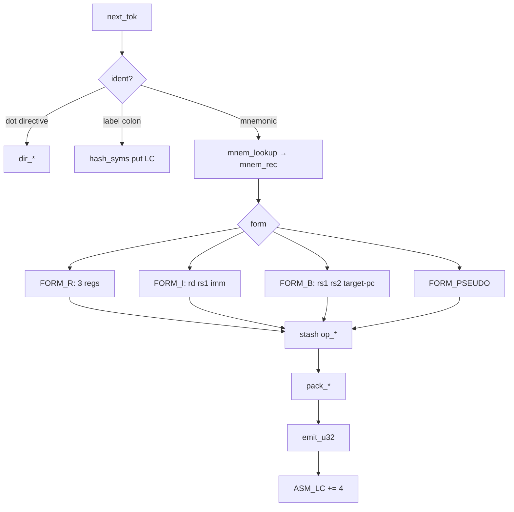

# Encodings

How a guest instruction becomes 32 bits, and how those bits become a `dec_t`. Both the assembler (`src/asm/compile.asm`, `src/core/bits.asm`) and the decoder (`src/core/decode.asm`) share [`src/include/rv32.inc`](../src/include/rv32.inc). If those two paths disagree, a test in `tests/test_asm.asm` or `tests/test_decode.asm` should fail before a guest program does.

## Formats

RISC-V is five packing functions plus a system encoding. Immediate bits are **not** a contiguous field; they are scattered so `imm[0]` of B/J is implicit zero (halfword alignment).

```
31          25 24    20 19    15 14  12 11     7 6      0
┌─────────────┬────────┬────────┬──────┬────────┬────────┐
│    funct7   │  rs2   │  rs1   │funct3│   rd   │ opcode │  R
├─────────────┴────────┤        │      │        │        │
│        imm[11:0]     │  rs1   │funct3│   rd   │ opcode │  I
├─────────────┬────────┤        │      │        │        │
│  imm[11:5]  │  rs2   │  rs1   │funct3│imm[4:0]│ opcode │  S
├─────────────┤        │        │      ├────────┤        │
│imm[12|10:5] │  rs2   │  rs1   │funct3│imm[4:1|11] opcode│  B
├─────────────┴────────┴────────┴──────┤        │        │
│            imm[31:12]                │   rd   │ opcode │  U
├─────────────┴────────┴───────────────┤        │        │
│     imm[20|10:1|11|19:12]            │   rd   │ opcode │  J
└──────────────────────────────────────┴────────┴────────┘
```

`pack_r` / `pack_i` / `pack_s` / `pack_b` / `pack_u` / `pack_j` in `src/core/bits.asm` implement the arrows; `inst_imm_i` and friends undo them with sign extension to 32 bits.

## Opcode map (what Planck actually decodes)

| `inst[6:0]` | Format | Family |
|---|---|---|
| `0x03` | I | loads |
| `0x0F` | I | `fence` |
| `0x13` | I / I-shift | OP-IMM |
| `0x17` | U | `auipc` |
| `0x23` | S | stores |
| `0x33` | R | OP and M (`funct7 = 1`) |
| `0x37` | U | `lui` |
| `0x63` | B | branches |
| `0x67` | I | `jalr` |
| `0x6F` | J | `jal` |
| `0x73` | I | system / CSR / `ecall` |

Anything else, or an illegal `funct3`/`funct7` pair, is `ID_ILLEGAL` and takes an illegal-instruction trap.

## Assembler data path

Parsed operands **must not** live in SysV caller-saved registers across a `call`. `reg_lookup` uses `r8` as its table index; `hash_get` overwrites `r8` with a slot pointer. The compiler therefore parks `rd` / `rs1` / `rs2` / `imm` in BSS (`op_rd` … `op_imm`) until `pack_*`.

The image pointer returned to `asm_compile`'s caller is the same class of bug one level up: `r14`/`r15` are the SysV callee-saved pair the function *thought* it could use for `void **out` and `uint64 *outlen`, but `parse_mem` and `.ascii` already own them. Those two pointers live in BSS as well (`asm_outp`, `asm_lenp`).



Two passes share that path. Pass 1 assigns labels and advances `ASM_LC` without writing bytes. Pass 2 resolves symbols to guest addresses, checks B/J range, and stores little-endian words into `img_buf`.

PC-relative immediates are `target - ASM_LC` **before** the instruction is emitted, so the location counter is still the address of the branch/jump itself.

## Shift immediates

`slli` / `srli` / `srai` are I-type with `imm[11:5] = funct7` and `imm[4:0] = shamt`. The assembler builds that 12-bit field, then calls `pack_i`. `srai` has `funct7 = 0x20`; the others have `0x00`. Using a clobbered `mnem_rec` pointer here used to encode the opcode as garbage, the shift parser keeps the record in `r11` with no intervening calls.

## `li` and `la`

`li rd, imm` is `addi` when the whole immediate fits in 12-bit signed; otherwise `lui` of `lui_hi(imm)` plus `addi` of `sext12(imm)` when the low part is nonzero.

`la rd, label` is the PC-relative twin: `auipc` + `addi`, same hi/lo split, offset = `label - pc`.

```
lo = sext12(imm[11:0])
hi = (imm - lo) >> 12          ; 20 bits
```

When `imm[11] = 1`, `lo` is negative and `hi` is one larger than `imm[31:12]`. That is the usual RISC-V `lui` adjustment, not a Planck invention.

## Round-trip test

`tests/test_asm.asm` assembles a string that uses ABI names (`t0`…`t4`) on R-type, `mv`, `slli`, and `bge` to a local label, then compares each word to `pack_*` of the architectural register numbers. That is the regression for the SysV clobber bug: `add t4, t0, t1` must be `add x29, x5, x6`, not whatever `r8` happened to hold after the last `reg_lookup`.
