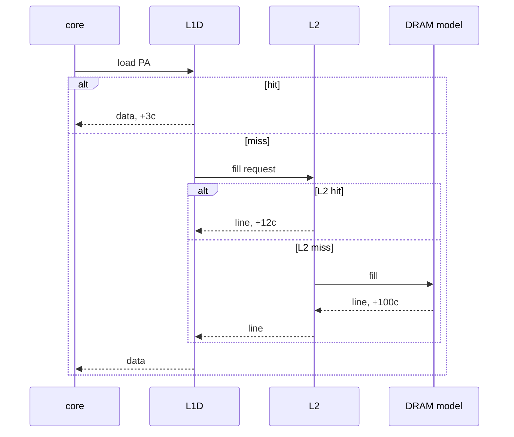

# Memory system

Planck's memory system is a three-level hierarchy in front of a single DRAM latency, plus a TLB that currently caches identity translations. It is a **timing** structure first. Functional mode bypasses it and hits the mmap region directly, so the golden model cannot be wrong because of a cache bug. OoO mode cannot.

## Geometry

| Level | Size | Assoc | Line | Hit lat | Write policy | Allocate |
|---|---|---|---|---|---|---|
| L1I | 16 KiB | 2-way | 64 B | 1 | , (read only) | on miss |
| L1D | 16 KiB | 4-way | 64 B | 3 | write-back | write-allocate |
| L2  | 256 KiB | 8-way | 64 B | 12 | write-back | on L1 eviction / miss |
| DRAM | guest RAM | 1 | 64 B | 100 | | |
| ITLB / DTLB | 32 entries each | fully assoc | 4 KiB page | 1 hit / 8 miss | | |

Line size is 64 everywhere so a fill is one object. Indexing is physical (guest PA), bits `[block_off | set | tag]`.

```
64-byte line
PA[5:0]   offset
L1I:  128 sets  (16KiB / 64 / 2)   PA[12:6] index, PA[31:13] tag
L1D:   64 sets  (16KiB / 64 / 4)   PA[11:6] index, PA[31:12] tag
L2:   512 sets  (256KiB / 64 / 8)  PA[14:6] index, PA[31:15] tag
```

Replacement is **true LRU** at L1 (2- and 4-way are cheap) and **bit-PLRU** at L2 (8-way). Both are tested with access sequences, not with “did the hit counter move.”

## Inclusion

L2 is **inclusive** of L1I and L1D. Evicting an L2 line invalidates the corresponding L1 line if present. That costs a back-invalidate probe, counted as `l2.backinval`. Inclusive makes the “where is this line” question answerable with one L2 lookup, which is why real server parts did it for so long.

There is one hart. There is no MESI directory. Lines in L1D are effectively M or E; L1I is S-or-not. A store to a line that also sits in L1I invalidates L1I (self-modifying code is rare and now correct). Counted as `l1i.smc_inval`.

## Fill path



Miss status: each L1 has 4 MSHR-like slots (`inflight[4]` of `{valid, pa_line, remaining, dest}`). A second miss to the same line attaches and does not start a second fill. A fifth concurrent miss stalls the LSU. Counted as `l1d.mshr_full`.

Instruction fill is the same against L1I, with its own 2-entry inflight table. Fetch stalls on `stall.fetch_icmiss` until remaining hits 0.

## Write-back

Dirty L1D evictions write the line into L2 (which may itself miss, in which case L2 evicts to DRAM first, DRAM writes are 100c and occupy a single write port). We do not model a write queue beyond “one eviction in flight per level.” That is pessimistic and simple.

## Unaligned accesses

A load/store that straddles two lines is two probes, two potential misses, one architectural result. The LSU splits, waits for both, then splices bytes. Functional mode does a single memcpy-shaped read and does not care.

## TLB

Machine mode identity map: `va == pa`, page size 4 KiB. The TLB still:

- Looks up `va[31:12]`
- On miss, pays 8 cycles and inserts `{vpn, ppn=vpn, perm=RWX}`
- LRU among 32 fully associative entries

Why: so I$ and D$ indexes are gated on a translation that can miss, which is what a real M-mode hart with the MMU off still approximately does when it walks a PMA checker. Also so a future Sv32 patch has a place to live.

A TLB shootdown is `sfence.vma` if we ever decode it; currently `FENCE` drains pipelines and also clears nothing in the TLB. Documented so you do not assume otherwise. Tests that self-map do not exist because the map cannot change.

## Functional vs OoO memory

| | Functional | OoO |
|---|---|---|
| Path | `guest_load` / `guest_store` | LSU → L1D → L2 → DRAM |
| Latency | 0 host-modeled | as table |
| Unaligned | works | split |
| SMC | instruction fetch sees store immediately | L1I invalidate on D$ store to same line, then refetch |

The golden-model tests run functional. The cache unit tests poke L1/L2 through a tiny host-side API (`cache_probe`) that the OoO LSU also uses, so a LRU bug fails without needing a guest program to be unlucky.

## Counters

`l1i.hit`, `l1i.miss`, `l1d.hit`, `l1d.miss`, `l1d.writeback`, `l2.hit`, `l2.miss`, `l2.backinval`, `l1d.mshr_full`, `l1i.smc_inval`, `tlb.hit`, `tlb.miss`, `dram.fills`, `dram.writebacks`.

Miss rate is `miss / (hit+miss)`, not `miss / instret`. IPC already captured the latter indirectly.
