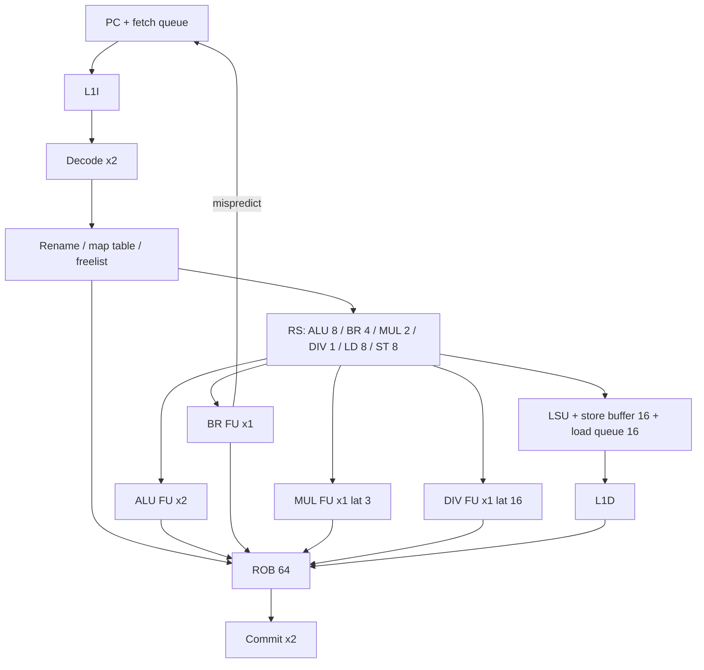

# Microarchitecture

Planck's timing model is a 2-wide, in-order-commit, out-of-order-issue machine. The vocabulary is Tomasulo with a reorder buffer: reservation stations snoop a result bus, the ROB is the commit queue, and the register file you can name in assembly is a fiction maintained by a map table.

This document is the invariant list. `src/ooo/*.asm` is the implementation. If they drift, the tests that run the same binary in `--mode functional` and `--mode ooo` are the judge.

## Block diagram



## Widths and capacities

| Knob | Value | Why |
|---|---|---|
| Fetch | 2 | Matches decode. No taken-branch in the same bundle for simplicity: a taken predicted branch stops the fetch bundle. |
| Decode | 2 | One decoder, two iterations. Illegal ops still take a ROB slot so exceptions are precise. |
| Issue | 2 | One scheduler pass, two oldest-ready wins. Not age-indexed beyond “scan order is ROB order.” |
| Commit | 2 | Stores commit 1 per cycle if the head is a store (L1D port). Non-stores commit 2. |
| ROB | 64 | Small enough to scan, large enough that a 16-cycle divide does not immediately stall fetch on a microbenchmark. |
| Physical regs | 96 | 32 architectural + 64 inflight. `x0` has a dedicated zero preg (`preg 0`) that is never on the freelist. |
| Store buffer | 16 | Must be ≤ ROB, obviously. 16 is the LSU scan budget. |
| Load queue | 16 | Same. |

All knobs are `equ` in `src/include/ooo.inc`. Changing them does not require hunting immediates in the pipeline.

## Register rename

Front-end map: `map_s[32]` (speculative). Commit map: `map_a[32]` (architectural). Freelist: ring of preg indices 1..95.

On dispatch of `rd != x0`:

```
old = map_s[rd]
new = pop(freelist)          ; stall rename if empty
rob.entry.old_preg = old
rob.entry.dst_preg = new
rob.entry.rd       = rd
map_s[rd] = new
```

On commit of that entry:

```
if map_a[rd] != 0 and map_a[rd] != dst: push(freelist, map_a[rd])
map_a[rd] = dst
```

The previous architectural preg is freed **at commit**, not at dispatch. Freeing at dispatch is how you get “why did this load read a value from the future.”

On squash of an entry (young to old walk):

```
map_s[rd] = old_preg
push(freelist, dst_preg)     ; the speculative dest dies
```

`x0` never allocates. Reads of `x0` always source preg 0, which is wired to 0 and never written. A `DIV` with `rd = x0` still occupies a ROB slot and a FU because it can trap or, in our case, cannot trap but still has latency. We still do not allocate a dest preg.

Source operands:

```
p = map_s[rs]
if prf.valid[p]:  operand = prf.val[p], ready = 1
else:             operand tag = p,      ready = 0
```

The physical register file is the only place values live. ROB entries hold a copy at writeback for debug dumps, not as a second source of truth.

## Reservation stations

Distributed, not a unified scheduler:

- ALU: ADD/SUB/logical/shifts/SLT/LUI/AUIPC/MOV-like copies
- BR: BEQ/BNE/BLT/… and the “is this JALR target matching the predicted NPC?” check
- MUL: the four MUL*
- DIV: the four DIV/REM*
- LD, ST: see LSU

An RS entry holds `{rob_idx, op, preg_dst, src1_val, src1_tag, src1_rdy, src2_val, src2_tag, src2_rdy, imm, pc, pred_npc, valid}`.

Wakeup is a broadcast of `(tag, val)` at writeback. We do a linear scan. A CAM would be more honest to hardware; a linear scan is more honest to 64-entry assembly. Both are O(n). The stats counter `sched.wakeup_scans` exists so you can feel it.

Ready ops issue oldest-first: the scan walks RS in allocation order, which is approximately program order, which is a decent approximation of age. It is not a collapsing queue. Compaction happens when an entry writes back: `valid` is cleared and that slot may be reused.

## Functional unit latencies

Issued cycle is cycle 0. Result is on the bus at the start of cycle `lat`.

| FU | lat | Notes |
|---|---|---|
| ALU | 1 | Result available next cycle. |
| BR | 1 | Mispredict detected at writeback, squash at tick end, fetch redirected next cycle. 1-cycle bubble minimum, plus whatever was in flight. |
| MUL | 3 | Fully pipelined: a new mul may issue each cycle. |
| DIV | 16 | **Not** pipelined. Occupies the FU for 16 cycles. |
| LD hit L1 | 3 | Plus extra if L1 miss (L2 12, DRAM 100). |
| ST-to-LD forward | 1 | Same-size, same-address, data ready in the store buffer. |

ALU `lat = 1` means a producer ADD cannot feed a consumer ADD in the next issue slot of the **same** cycle. Same-cycle bypass is not modeled. That costs IPC on tight chains and is called out in `--stats` as `stall.scoreboard` when sources are not ready.

## LSU

Stores:

- At dispatch, a store allocates an ST RS and a store-buffer slot, tagged by ROB index.
- Address generation issues when `rs1` is ready. Data may arrive later.
- The store may not write L1D until **commit**. Before that, younger loads search the store buffer.

Loads:

- AGU when `rs1` ready.
- Search store buffer from youngest older store to oldest:
  - unknown address (`addr_ready = 0`): stall this load (conservative). Count `lsu.addr_block`.
  - overlap, different size: replay later. Count `lsu.size_block`.
  - exact same address and size, data ready: forward, do not go to D$.
  - no overlap: continue search, then L1D.

Load queue records `{addr, size, issued_cycle, rob_idx}`. When a store later (older in program order, later in wall time) writes bytes a load already issued against, the load is replayed: its ROB entry is marked incomplete, the dest preg is not broadcast again until the replay finishes. This is the correctness hammer. We do not speculate past unknown stores.

Unaligned loads that cross a 64-byte line issue two cache probes and add the penalties. Unaligned stores do the same at commit.

## Precise exceptions and mispredicts

Exceptions are recognized at execution but **taken at commit**. An illegal instruction sitting in the ROB under a mispredicted branch dies with the squash and does not write `mcause`. That is the whole of precise exceptions.

Mispredict recovery:

1. Branch FU compares actual NPC to `pred_npc` stored at dispatch.
2. On mismatch: ROB entry flagged `mispred`, `correct_npc` stored.
3. End of tick: walk ROB from tail down to the branch, squash each, restore `map_s`, free dest pregs, cancel RS/LSU entries with `rob_idx` in that range.
4. Fetch queue cleared. `pc = correct_npc`. RAS repaired only if the branch was a call/ret we had pushed; we checkpoint RAS TOS in the ROB entry for that.

A correct prediction still occupies the BR FU. There is no “branch predictor bypasses execution.” The predictor only supplies fetch NPC.

## Stalls we count

| Counter | Meaning |
|---|---|
| `stall.fetch_icmiss` | Fetch waited on I$ |
| `stall.decode_empty` | Decode had no fetch-queue bytes |
| `stall.rename_fr` | Freelist empty |
| `stall.rob_full` | ROB full |
| `stall.rs_full` | No RS of the right class |
| `stall.sb_full` | Store buffer full |
| `stall.fu_busy` | Ready op, FU occupied (div, mostly) |
| `stall.scoreboard` | RS occupied but sources not ready, no issue |
| `stall.redirect` | Cycles with fetch diverted after squash |
| `lsu.replay` | Load-queue violations |
| `br.mispred` | Committed mispredicts (not fetched) |

`--stats` prints these as a table, then IPC, then predictor and cache numbers from their own documents.

## What we refused to fake

- No infinite store buffer.
- No same-cycle ALU bypass.
- No fetch past a predicted-taken branch in the same bundle.
- No “L1 always hits.”
- No interrupt in the middle of a tick without going through commit (we almost do not have interrupts).

The machine is small. It is not a cartoon.
