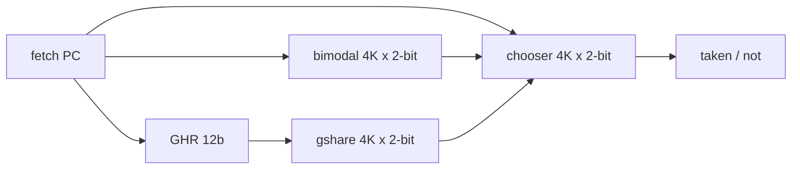

# Branch prediction

Fetch needs a next PC before decode has seen the instruction. Planck's predictor is a textbook tournament: two direction predictors, a chooser, a BTB for targets, a RAS for returns.

None of this affects the functional core. The OoO core's fetch stage is the only client. Commit-time branch outcomes train the tables. Speculative training is not done; it would require a repair story we did not want on the first core.

## Tournament



- **Bimodal.** Index = `pc[13:2]` (instruction-aligned). 2-bit saturating counter: 00/01 not-taken, 10/11 taken. Initialize to 01 (weak not-taken).
- **Gshare.** Index = `pc[13:2] xor GHR`. Same counters. GHR is 12 bits, shift-in committed outcome (`1` = taken).
- **Chooser.** Index = `pc[13:2]`. Counter toward gshare when gshare was right and bimodal was wrong, toward bimodal on the opposite. Both right or both wrong: no update. Initialize to weak bimodal so cold code is stable.

A 2-bit counter update is the usual saturating inc/dec. There is no hysteresis trick beyond that.

## BTB

128 entries, direct-mapped, tagged with `pc[31:2]`.

```
index = pc[8:2]          ; 7 bits
tag   = pc[31:2]
tgt   = predicted NPC
kind  = not/cond/call/ret/jal
valid
```

- On predicted **taken** (or always-taken `JAL`/`JALR` that is not a return): fetch NPC = BTB target if hit, else `pc+4` (we will eat a mispredict).
- On predicted **not-taken**: NPC = `pc+4` even if the BTB hits. The BTB still updates the target on commit so the next taken has it.
- `JAL` is treated as always taken. `JALR` is taken, target from BTB or RAS.

Direct-mapped is a choice. A 2-way BTB would alias less; 128 direct is readable in assembly and matches the “small core” story. Aliases are counted as `btb.alias` when a tag mismatches at a valid index.

## RAS

16-entry circular stack of return addresses (`pc+4` of the call).

Call detection at fetch (using BTB `kind=call`, or at decode once we know `JAL rd` with `rd=x1/x5`): push `pc+4`.

Return detection: `JALR x0, 0(x1)` or `JALR x0, 0(x5)` — the ABI returns. Fetch NPC = RAS TOS, pop.

ROB entries for calls/returns store `{ras_tos_before, ras_val}`. Squash restores TOS so a mispredicted call does not leave a garbage return address for a later true return.

Underflow (return with empty RAS): predict `pc+4`, almost certainly mispredict, counted as `ras.underflow`. Overflow: overwrite the oldest, counted as `ras.overflow`. Deep recursion in `programs/fib.s` is a RAS stress; `--stats` on that file is not a joke.

## What is predicted vs executed

The predictor supplies fetch NPC. The branch FU **always** executes. A correct prediction still pays the 1-cycle BR occupancy. We do not have a “predicted-not-taken cond branch that never enters RS” fast path. That would be a different core.

Indirect jumps (`JALR` not a return) live and die by the BTB. No indirect target cache. Cold function pointers mispredict once per destination.

## Training timing

Updates happen when the branch **commits**, in program order. GHR therefore contains committed history, not speculative. That underperforms a speculative GHR on some patterns and is immune to poisoning from a wrong-path burst. Both sentences are load-bearing.

## Counters

`br.lookups`, `br.pred_taken`, `br.mispred` (committed), `br.bimodal_win`, `br.gshare_win`, `btb.hit`, `btb.miss`, `btb.alias`, `ras.hit`, `ras.mispred`, `ras.overflow`, `ras.underflow`.

Mispredict rate in `--stats` is `br.mispred / committed_branches`, not `/ instret`.
