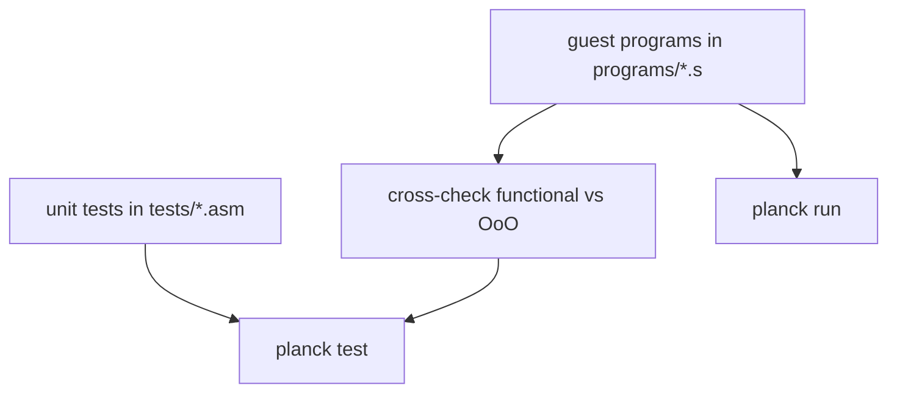

# Verification

Planck has two cores and one spec. The spec is the functional interpreter plus [`ISA.md`](ISA.md). Everything else is guilty until it matches.

## Layers



`planck test` is an assembly program linked into the same binary, not a Python runner. It calls exported `test_*` functions, each of which prints `ok  <name>` or `FAIL <name> <detail>` and bumps a fail counter. Exit code is the fail count.

## Unit tests (host-side)

These poke structures without a guest:

| File | Claims |
|---|---|
| `tests/test_hash.asm` | FNV hashmap put/get/grow/miss |
| `tests/test_decode.asm` | hand-encoded insns → fields |
| `tests/test_alu.asm` | every ALU op including SRA sign, SLTU edge |
| `tests/test_m.asm` | MULHSU, DIV by zero, INT_MIN/-1 |
| `tests/test_mem.asm` | unaligned LW/SW, sign extend LB |
| `tests/test_branch.asm` | taken/not, JALR bit0 clear |
| `tests/test_csr.asm` | CSRRS rs1=x0 does not write, cycle aliases |
| `tests/test_asm.asm` | assemble string, compare bytes to hand encodings |
| `tests/test_cache.asm` | LRU sequence, write-back dirty, MSHR merge |
| `tests/test_predict.asm` | counter saturate, gshare index, RAS overflow |
| `tests/test_rename.asm` | x0 not allocated, squash restores map |
| `tests/test_lsu.asm` | store forward, size mismatch replay |

Each ALU test is of the form: reset CPU, write `x1, x2`, plant one insn at the reset vector, `interp_step`, compare `x3` and `pc`.

## Guest programs (end-to-end)

| Program | Why it exists |
|---|---|
| `programs/exit0.s` | smallest image |
| `programs/fib.s` | recursion, RAS, stack |
| `programs/fact.s` | linear mul chain |
| `programs/memcpy.s` | unaligned D$ |
| `programs/crc32.s` | table in `.data`, byte loads |
| `programs/qsort.s` | branches, indirect calls (function pointer compare) |
| `programs/matmul.s` | nested loops, I$ + D$ pressure |
| `programs/branchy.s` | random-looking but deterministic branch mix for the tournament |
| `programs/dhrystone.s` | a compressed-ish integer kernel, not a SPEC score |
| `programs/selfmod.s` | store then execute; SMC invalidate |

Each program `ecall exit` with a code. `0` means the program's own checks passed (they compute a checksum in `a0` and compare to a constant). `planck test` also runs them under both modes and compares final `x1..x31` plus a SHA-ish xor-fold of the data page.

## Cross-check protocol

```
assemble(src) -> image A
cpu_reset; load A; functional until halt; snapshot regs, fold RAM
cpu_reset; load A; ooo until halt or max_cycle; snapshot
compare
```

Mismatch prints the first register that differed and the last 16 committed PCs from the ROB trace ring. That ring is 16 deep and exists only because this compare failed while the core was being written.

## What we do not test

- Multi-hart races (no second hart).
- Page table walks (identity only).
- IEEE-754.
- C extension.
- Linux binaries.

## Reproducing a failure

```
./bin/planck run --trace --dump-regs programs/foo.s
./bin/planck run --mode ooo --stats --dump-regs programs/foo.s
```

`--trace` in functional mode prints `pc inst disasm` per retire. In OoO it prints at **commit**, so the stream should match functional if the core is correct. If `--trace` streams diverge, the bug is in retire order, not in fetch.

## CI

`.github/workflows/ci.yml` builds the Docker image on `ubuntu-latest` (`linux/amd64`) and runs `planck test` and a subset of `planck run --mode ooo`. Apple Silicon contributors use the same Dockerfile locally with `--platform linux/amd64`.
