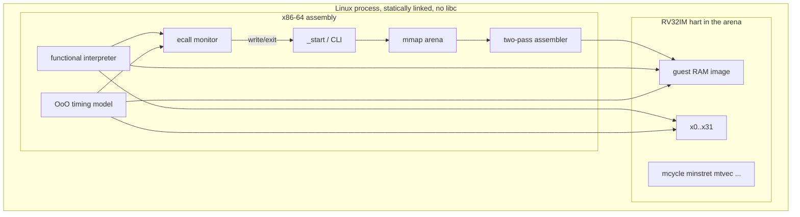
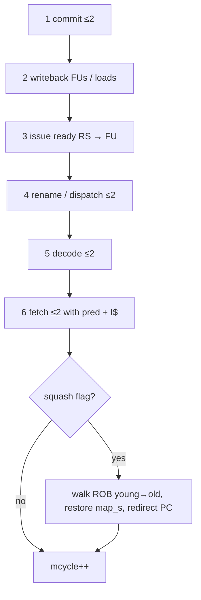
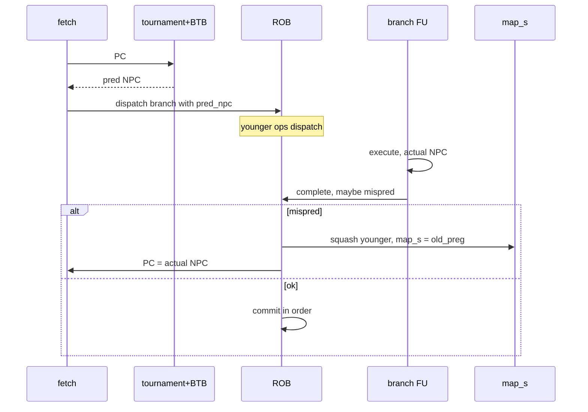
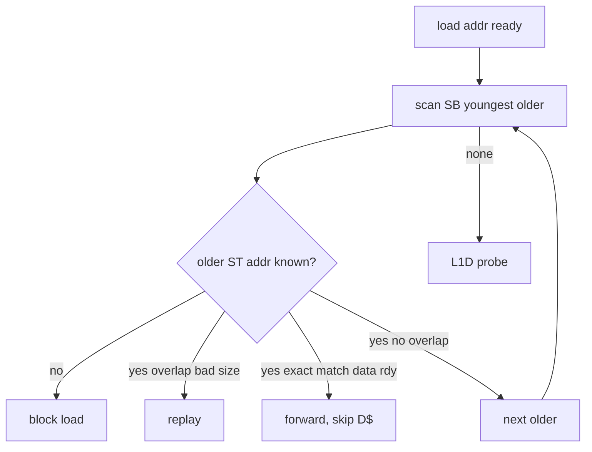
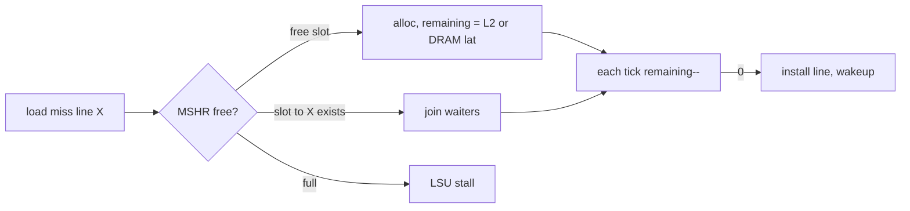
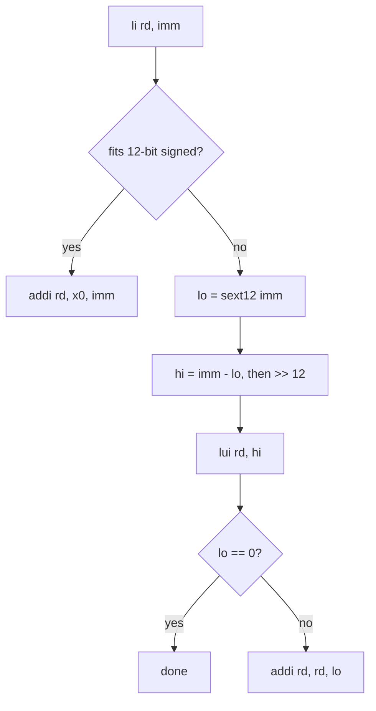
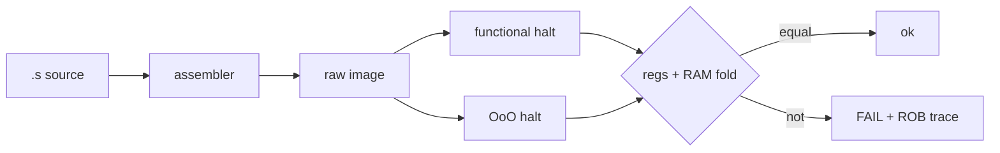
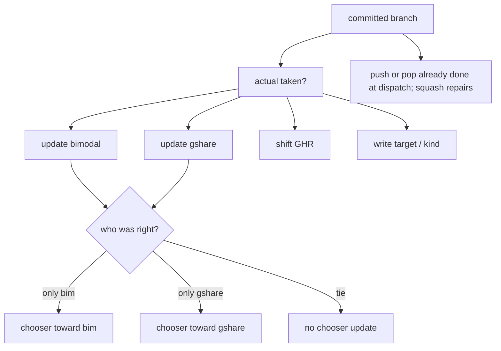
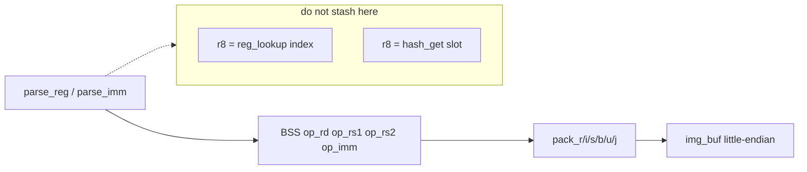
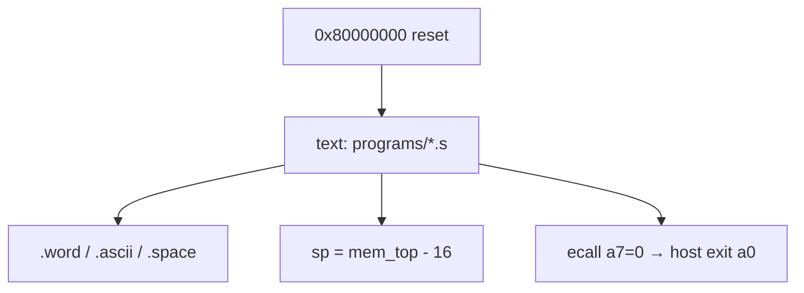

# Diagrams

Collected mermaid for people who open this file first. Prose lives in the sibling documents.

## Host / guest cut

## One OoO cycle

## Mispredict

## Store forwarding

## Cache fill with MSHR merge

## `li` expansion

## Test cross-check

## Predictor update at commit

## Assembler encode (where operands live)

`add t4, t0, t1` must pack `rd=29, rs1=5, rs2=6`. If `rd` is left in `r8` across the last `parse_reg`, it becomes `6` and the guest sees `add t1, t0, t1` — or, worse, an illegal encoding.

## Guest program map

